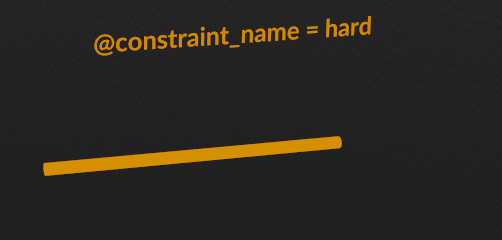
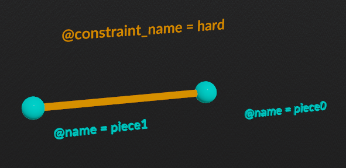
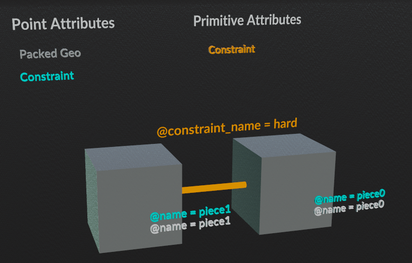
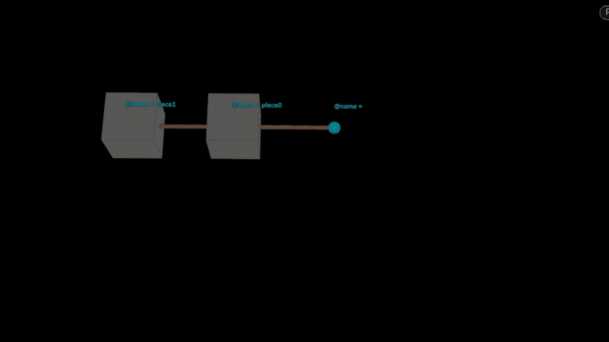
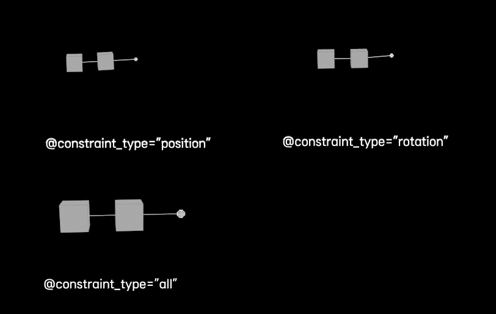

# Constaints and RBD 101


## 앞서
::: warning
옳지 않은 설명이나 보충이 필요한 설명은 저에게 연락해주시면 언제든 리비전을 적겠습니다.
해당 문서의 author 란에 함께 기재할 예정이며 문서의 하단에도 같이 기재하고 있습니다.

:::

### r (Assumption)

두 상자가 놓여져 있다고 가정하고 우리는 이 상자들을 piece 0, piece 1 지오메트리라 부르겠습니다.
@name="piece0" 는 pack 된 지오메트리 이기 때문에 포인트 레벨의 어트리뷰트입니다. 기억해주세요. 


그리고 두 상자를 이어주는 끈이 있습니다. 이것을 Constraint 라 부르겠습니다.
@constraint_name="Hard" 는 primitive 레벨에 위치합니다.



constraint 끈의 양 끝에 점들이 있겠죠? 이 두 point 들의 point attribute 인 @name을 지어줍니다.



자 이제.. 시작해볼까요?




### Basics and Simulation

후디니에서는 polyline 을 통해 rigid body 의 constraints 를 구성할 수 있습니다. 이 컨스트레인트 라인의 끝에는 두개의 점이 있는데 이 점들은 geometry 이름을 point 레벨의 속성에 보관하고 있습니다. 

물론 packed 된 geometry 들의 점들에도 point 레벨 속성에 같은 geometry 이름을 갖고 있습니다. 
일치하지 않으면 해당 포인트는 어떤 프리미티브와 연결되어야 할지 찾을 수 없으므로 붙어있지 않겠죠? 

:::warning
Hard Constraint 에는 @restlength 가 필요합니다. restlength는 두 물체의 간격을 저장하기 때문에 초기 단계에 설정이 필요합니다. 없으면 시뮬레이션 시작과 동시에 달라붙고 실제 거리보다 큰 값이 저장되면 시뮬레이션 시 늘어납니다. 

재미를 위해 point wrangle을 달고 @restlength *= 5 해보세요.

예제에서는 우리는 converline SOP을 사용해  자동으로 계산할겁니다.
:::

가정에서 구성한바와 동일하게 만들고 재생을 하면?


아주 간단하고 기본적인 constraint를 포함한 rigid body simulation이 완성되었습니다.


### 이름 없는 Constraint 으로 고정된 포인트 만들기 

constraint 는 해당 포인트와 packed primitive의 @name 어트리뷰트가 일치해야 연결됨을 알려드렸습니다. constraint 에서 포인트를 하나 더 만들고 이름을 @name=""로 줘봅시다. 위치는 적당히 옮겨보시구요. 그렇다면'





constraint 에 null 네임을 주는것 말고 primitive 의 속성을 건드려 다르게 적용해볼 수 있습니다. 

packed geometry 인것을 계속 감안해주세요. 왜냐햐면 우리는 @active 속성을 point level에 적용해야 하기 때문입니다.

```vex
if(@name=="piece2")@active=0;
else @active=1;
```


와~ 신난다. 이제 더 많은것을 할 수 있을것 같은 느낌이 듭니다. 


### Constraint 의 종류

위 예제는 기본적으로 두 물체가 어떻게 연결되는지 이해시키기 위해 Hard 를 사용했지만 후디니의 Constraint 에는 여러 종류가 있습니다. 나열해보자면 

Hard Constraint
Glue Constraint
Soft Constraint
Spring Constraint

몇가지가 더 있지만 생략하겠습니다. 하나하나 알아볼까요..?

### Hard Constraint

외부의 force에 깨지지 않으며 Constraint 의 @restlength 어트리뷰트, @constraint_type 지정이 반드시 필요합니다.

단단한 바벨을 떠올려봅시다. 

양 끝 두 점에 @constraint_type 라는 어트리뷰트도 있어야 합니다. 따로 지정되지 않을때에는 "position" 으로 간주됩니다. 
헷갈리겠지만 position이 constraint 되는 것이라 @constraint_type = "position" 따라서 rotation인 회전이 자유로워 지고 반대는 .. 뻔하죠? position이 자유로워 집니다.




### Soft Constraint

Hard constraint 에 비해서 rigid 한 느낌이 덜 한, 결국 복원력이 덜 하여 탄성이 잘 표현됩니다. Hard 와 마찬가지로 collider 의 impact나 force 로 부서지지 않습니다만 restlength 기준으로 constraint를 끊어줄 수 있습니다.
Hard Constraint 의 @constraint_type을 포함하여 Stiffness, Propagation Rate, Half-Life 등의 어트리뷰트들이 있음.

### Glue Constraint

부서지기 전까지는 하나의 물체처럼 움직입니다. 충분한 force가 가해질 경우 부서질 수 있게 @strength 어트리뷰트가 존재합니다.


### 요약

|   | Hard Constraint | Soft Constraint | Glue Constraint |
| -- | -- | -- |-- |
| 끊어질 수 있는가  | 특별 조건을 주는 한  | 특별 조건을 주는 한 | 외부의 힘으로 |
| 유연한가  | 아주 딱딱함  | stiffness 조절로 탄성 조절 가능 | 끊어지지 않는 한 |
| 대표 속성  | s@constraint_type  | s@constraint_type, @stiffness | @strength |
```


```